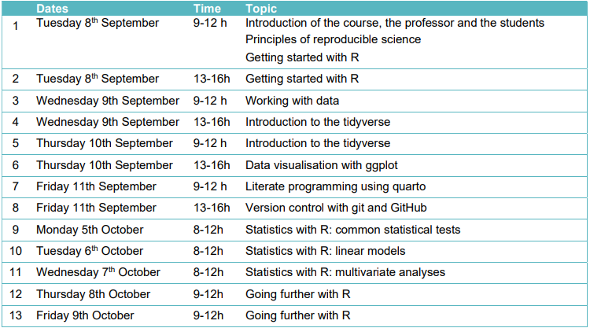

# Introduction and expectations toward this module

::: {.notes}
introducing everyone: 
* who
* topic of Msc/PhD project, with whomm?
* expectations / interest in the class?
:::

## Practical information

- **Discipline** *Transferência de informações florestais* (Code: EFL360457)
- **Credits** 4
- **Workload** 60h (about 42h presential)
- **Schedule**  Second semester of 2026 in a semi condensed way (**8th to 11 of September** and **5th to 9th of October**)

## Practical information

You will work on your own laptop

**Please make sure you have all the programs and packages installed before the class.**

::: notes
Has the installation worked for everyone ? 
If not, let's try to sort the problems at the end 
of this presentation.
:::

## Targeted audiance

- **Areas de concentração** 
  * *Conservação da natureza*
  * *Manejo florestal*
  * *Tecnologia e utilização de recursos florestais*
- No previous experience with R but the course can also be beneficial for more experienced students.

::: {.notes}
aks about any previous exp in R, Python, other prog language
:::

## Learning outcomes

::: {.incremental}
- Define the concept of reproducible research and cite the main tools that it requires
- Understand the basis of R and R studio (interface, packages, basic functions...)
- Import, manipulate and export data in R
- Apply good practices in data management
- Organise the work in a R studio project
:::

## Learning outcomes

::: {.incremental}
- Use the main packages of the Tidyverse for tidy analyses
- Choose the appropriate graphics to explore the data and create them using ggplot
- Implement common statistical tests in R
- Understand and implement more advanced programming techniques (loops,
functions...)
- Use the tool Quarto to produce a report or a presentation with text and code
- Use git and GitHub for version control 
:::

::: {.notes}
Not a statistics course
:::

# Let's make the class interactive... *não importa o idioma* 

::: {.notes}
presentation in English
i'll talk mostly in English, don't hesitate to ask me to repeat/rephrase
you can ask questions in portuguese
:::

## Course program

{width=20%}

::: {.notes}
Please check the time of the next session.
AND BE ON TIME !
:::

## Assessment

**Final home assessment using the skills covered in class**

The exam instructions will be released on October 9th and
the completed assignment must be submitted by **November 9th**.

Objective: assessing your ability to implement a reproducible workflow in R for a study in forest sciences, using the tools covered during the class.

::: notes
This takes several hours, don't leave it until the last minutes.
Don't use ChatGPT (or use it wisely) as I will
see it and may ask you to come and explain what you have done!!!
:::

## About the personal work

You are encouraged to work, alone or in group,
between the classes, 
especially between the two weeks. 

I will provide corrected exercises.

## Mean of communication between the class

If needed, I will contact you by **email** (using the email provided in Sigaa).

## 

The course material has been created using R V4.6.1 and quarto, and the code is available on [GitHub](https://github.com/GeraldineDerroire/Course_R_Forest_Sciences){preview-link="false"}
and the course material is online [here](geraldinederroire.github.io/Course_R_Forest_Sciences/){preview-link="false"}.

  

