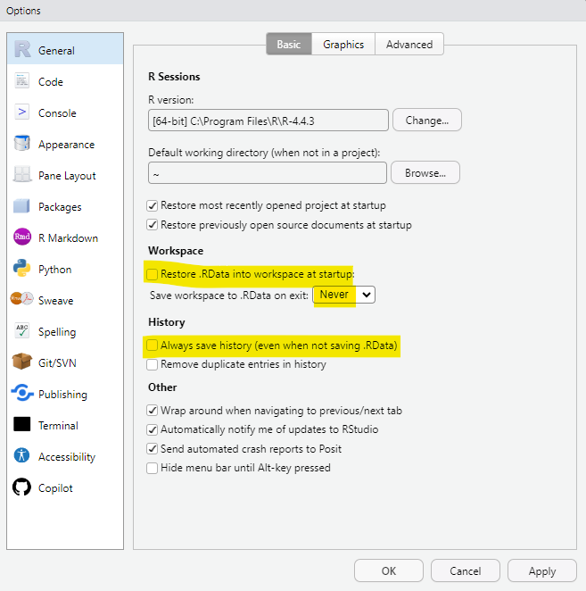
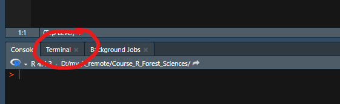
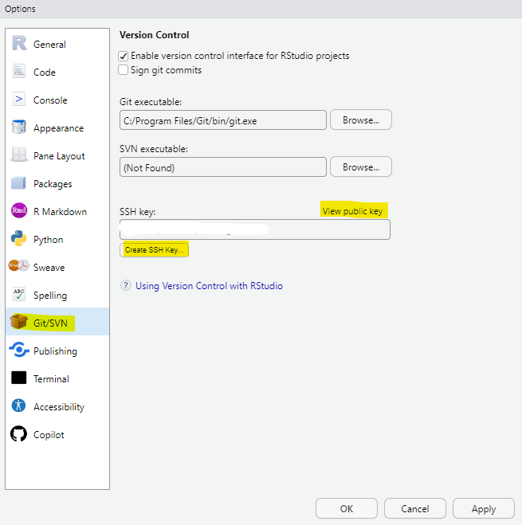
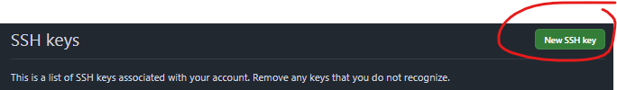

# 

We are going to install the following:

-   R
-   RStudio desktop
-   git
-   quarto

⚠️ In the following slides, click on the text in blue to follow the links.

This takes a bit of time, but you will just need to do it once 😉!

## Install R

[Install R](https://cloud.r-project.org/){preview-link="false"}

{height="150px"}

Accept all the default settings.

For those who already have R installed, please make sure that the version you are using is at least 4.4.0.
For this, run the following code:

```{r}
# Get R version
R.version.string
```

## Install RStudio

[Install RStudio desktop](https://posit.co/download/rstudio-desktop/){preview-link="false"}

{height="150px"}

*Don't reinstall R.*

## Installing git

[Install git](https://git-scm.com/downloads/win){preview-link="false"}

{height="150px"}

Accept the default options during installation.

## Install Quarto

[Install quarto](https://quarto.org/docs/get-started/){preview-link="false"}

{height="150px"}


# Check that the installation went well

Restart your machine.

Open RStudio and run the code on the following slides in the console.

## Check R version

```{r}
# Get R version
R.version.string
```

## Check if git is installed

```{r}
Sys.which("git")
```

The path won't be the same for you than here, but this is ok.

## Check if quarto is installed

```{r}
Sys.which("quarto")
```

The path won't be the same for you than here, but this is ok.

# Configuration

## Configure RStudio

::::: columns
::: {.column width="55%"}
I recommend not saving the workspace and the command history automatically. It is better to decide what you want to save.

For this, go to **Tools \> Global Options \> General** and select the options as shown here:
:::

::: {.column width="45%"}

:::
:::::

## Configure git

Before using git, you need to declare your name and email locally.

For this, open the RStudio terminal:



[⚠️ If you cannot see the terminal go on the menu *Tools/Terminal/New Terminal*]{style="font-size: 20px"}

and run:

```{r, eval=FALSE}
## Tell git your user name 
git config --global user.name  "Your Name"

## Tell git your email address 
git config --global user.email "your.name@mail.com"
```


## Configure git

Change the default branch name, by running the following in the RStudio terminal:

```{r, eval=FALSE}
## Rename default git branch 
git config --global init.defaultBranch main
```

## Check git configuration

In the RStudio terminal, run the following:

```{r, eval=FALSE}
## Check user name
git config user.name

## Check user email
git config user.email

## Check default initial branch
git config init.defaultbranch
```

## Create a GitHub account

Create an account on GitHub [here](https://github.com/signup){preview-link="false"}

{height="200px"}

[*GitHub may ask you to enable two-factor authentication (2FA) during account creation.
This is a security feature. Follow the instructions provided by GitHub.
Keep your recovery codes in a safe place.*]{style="font-size: 25px"}


## Create a GitHub SSH key

To communicate with GitHub, you need a SSH key :

::::: columns
::: {.column width="55%"}
-   Open RStudio and click on **Tools \> Global options \> Git/SVN**
-   Click on **Create SSH Key**
-   Choose ED25519 if available and click on **Create**
-   Click on **View public key** and copy it
:::

::: {.column width="45%"}

:::
:::::

## Create a GitHub SSH key

-   Go to the [key setting page in GitHub](https://github.com/settings/keys){preview-link="false"}
-   Click on **New SSH key**
-   Choose a name (e.g. My laptop) and paste your key
-   Click on **Add SSH key**



## Create a GitHub SSH key

Check if your key is working by typing the following in the RStudio terminal:

```{r, eval=FALSE}
ssh -T git@github.com
```

You should get a message telling you that you successfully authenticated, but GitHub does not provide shell access. 👍

When you first connect to GitHub, you will be asked if you want to continue connecting, answer *yes*.


# Install the needed R packages

Run the code below in the console:

```{r, eval=FALSE}
install.packages("vegan",
                 "questionr",
                 "tidyverse",
                 "janitor",
                 "patchwork",
                 "plotly", 
                 "ggspatial",
                 "multcompView",
                 "GGally",
                 "BIOMASS",
                 "MASS",
                 "ggeffects", 
                 "gtsummary", 
                 "ggstats", 
                 "lindia", 
                 "car", 
                 "AICcmodavg")
```


# Install the needed R packages

Install TinyTex by running the following R commands:

```{r, eval=FALSE}
install.packages('tinytex')
tinytex::install_tinytex()
```

and checking that it is installed:

```{r, echo = TRUE}
tinytex::is_tinytex() # should be TRUE
```

# Download the datasets that we will use: {.smaller}

Store these datasets in an accessible folder on your computer.

* [BCI.env_semicol](https://geraldinederroire.github.io/Course_R_Forest_Sciences/3_manip_data/data/BCI.env_semicol.csv){preview-link="false"}

* [BCI_env.csv](https://geraldinederroire.github.io/Course_R_Forest_Sciences/3_manip_data/data/BCI_env.csv){preview-link="false"}

* [func_traits](https://geraldinederroire.github.io/Course_R_Forest_Sciences/4_tidyverse/data/func_traits.csv){preview-link="false"}

* [commercial_sp](https://geraldinederroire.github.io/Course_R_Forest_Sciences/4_tidyverse/data/commercial_sp.csv){preview-link="false"}

* [data_tidyverse_2](https://geraldinederroire.github.io/Course_R_Forest_Sciences/4_tidyverse/data/data_tidyverse_2.RData){preview-link="false"}

* [data_statistics_1](https://geraldinederroire.github.io/Course_R_Forest_Sciences/6_basic_statistics/data/data_statistics_1.RData){preview-link="false"}

* [data_statistics_2](https://geraldinederroire.github.io/Course_R_Forest_Sciences/6_basic_statistics/data/data_statistics_2.RData){preview-link="false"}

# You are all set!

Parabens! 👏🥳💪

And if you have any problem 😢, please contact me.

## Acknowledgments

The content of this document is largely inspired by the [FRB-Cesab guide](https://frbcesab.github.io/rsetup/){preview-link="false"} written by Nicolas Casajus.
