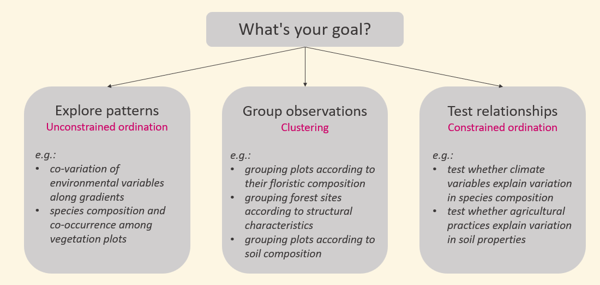
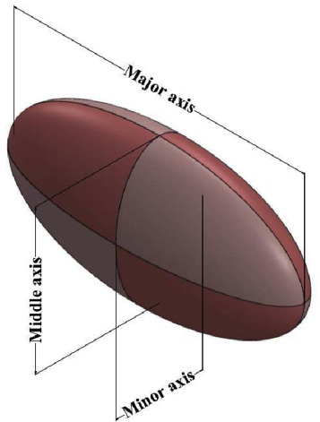
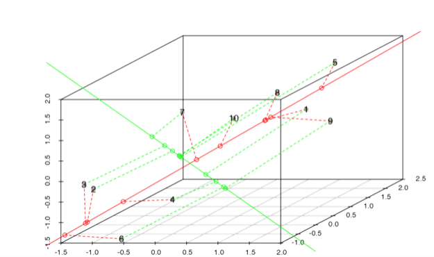
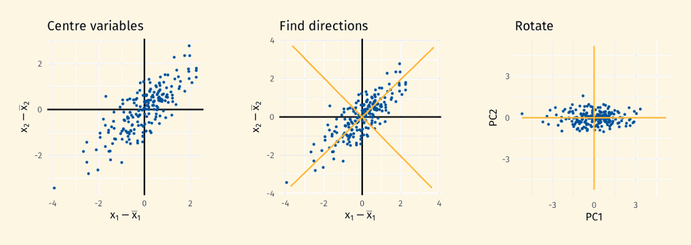
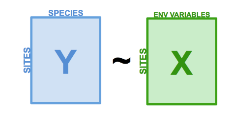
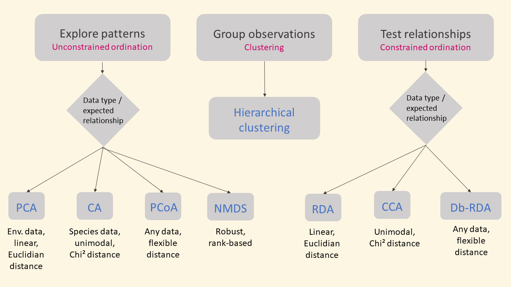

```{r}
#| echo: FALSE
#| message: FALSE
library(plotly)
library(tidyverse)
```

## Why multivariate analyses ?

**Multivariate analysis** are used to study the joint distribution of several variables, *i.e.* the variation of each variable and their correlations.

* **Clustering methods** aim to group observations based on similarities across multiple variables.

* **Ordination methods** aim to rearrange the observations in a lower-dimensional space to reduce the dimensionality of the data while preserving the main patterns of variation.

::: notes
last session, when more than 2 variables, there was just one univariate response variable, so different 

explain the reduction of dimensionality
:::

## Why multivariate analyses ?

**Ordination methods** can be used for: 

  * the identification axes of co-variation between several variables (*eg*: co-variation between climatic variables or soil variables along environmental gradients, co-variation of functional traits along specta of functional strategies...)
  
  * the study of ecological communities by jointly considering the occurrence or abundance of multiple species
  
  
## Why multivariate analyses ?



::: notes
unconstrained : eg soil variables that we know are very corralted, same for climatic variables

unconstrained: ex for phytosociology

clusturing: groups of plots based on foristic => phytosocio, habitat

contrsained: here specis composition is the multivariate data, and soil properties in the secon example

:::

## Structure of multivariate data {.smaller}


[*n*]{style="color:indianred;"} observations (in row) of [*p*]{style="color:indianred;"} variables (in column), where [$x_{ij}$]{style="color:indianred;"} is the value of the variable [*j*]{style="color:indianred;"} for observation [*i*]{style="color:indianred;"}:


\begin{bmatrix}
x_{11} & x_{12} & \cdots & x_{1p} \\
x_{21} & x_{22} & \cdots & x_{2p} \\
\vdots & \vdots & \ddots & \vdots \\
x_{n1} & x_{n2} & \cdots & x_{np}
\end{bmatrix}

[*Example:*]{.fragment}

* values of *p* environmental variables in *n* sites (observations)

* floristic composition (*p* species = variables) in *n* sites

* values of *p* functional traits (variables) for *n* species (observations)

::: notes
in the second ex, the species are the variables and the sites the observations

but in 3rd ex, the species are the observation and the functional traits their variables
:::


## Package *vegan*

There are many packages to do multivariate analyses: [stats]{style="color:indianred;"} (base package), [ade4]{style="color:indianred;"}, [FactoMine]{style="color:indianred;"}, [vegan]{style="color:indianred;"}.

We will mostly work with [vegan]{style="color:indianred;"}, let's load it:

```{r}
library(vegan)
```


## Let's work with data on understory vegetation in Fennoscandia {.smaller}

[These data are available in the package [vegan]{style="color:indianred;"} and include:]{style="font-size: 30px"}

::::: columns
::: {.column width="50%"}

* [A floristic table of cover of understory vegetation (species in colum and sites in row):]{style="font-size: 30px"}

::: fragment
```{r}
data(varespec)
varespec[1:5, 1:5] # display only a subset
```
:::

:::

::: {.column width="50%"}

* [Soil data on the 24 plots]{style="font-size: 30px"} 

::: fragment
```{r}
data(varechem)
varechem[1:5, 1:5] # display only a subset
```
:::

:::
:::::

[[For more information on these data see [Väre,Ohtonen and Oksanen (1995)](https://www.researchgate.net/publication/227830523_Effects_of_reindeer_grazing_on_vegetation_in_dry_Pinus_sylvestris_forests){preview-link="false"}]{style="font-size: 22px"}]{.fragment}

::: notes
Fennoscandia: Norway + Sweden + Finland + Parts of Russia
:::

# Unconstrained ordination methods

<!-- ressource

https://gavinsimpson.github.io/physalia-multivariate/03-wednesday/slides.html#1

https://r.qcbs.ca/workshop09/book-en/setting-up-our-goals.html

Marchand + Eric --> 

## Principle

[Unconstrained ordination methods are used to **visualise and explore the relationships among variables or observations** without imposing any specific constraints on the relationships.]{style="font-size: 30px"}

[The objective is to **identify a few axes that capture most of the variation** in a multidimensional dataset, allowing for a simplified yet informative representation.]{style="font-size: 30px"}

[This allows to **visualise similarities among observations**, as more similar observations will be closer in the reduced-dimensional spaces.]{style="font-size: 30px"}


::: notes
we are in a multidimentional space (nb of dimensions is the nb of variables)

imagine the obs as points in that multimentional spaces : 2 dim => scatterplot OK, 
3D still okish, 4D become impossible to visualise..., and nD....


:::

## PCA - Principle

Imagine a 3D point cloud (many observations for 3 variables) 
that has the shape of a rugby ball:

::: {.column width="50%"}

:::

::: {.column width="5%"}
:::

::: {.column width="45%"}
These would be the 3 axes allowing us to capture most of the variation in our dataset (*i.e.* that better describe the point cloud).
:::

::: notes
not sure if you are familiar with this... so I'll explain in several different ways...
:::

## PCA - Principle

[In a cloud of observations in a p-dimension space (*p* variables), a **Principal Components Analysis** fits:]{style="font-size: 30px"}

::::: columns
::: {.column width="60%"}

* [a [first line]{style="color:red;"} minimising the **Euclidean distance** between the line and the observations, hence maximising the variance captured.]{style="font-size: 30px"}

* [a [second line]{style="color:lightgreen;"}, orthogonal to the first one, capturing the maximum remaining variance.]{style="font-size: 30px"}

* [a third, a fourth, .... until we have $p$ lines]{style="font-size: 30px"}

:::

::: {.column width="40%"}

[Source: [E. Marcon](https://ericmarcon.github.io/Cours-R-Geeft/Ordination.html){preview-link="false"}]{style="font-size: 22px"}

:::

:::::

[[Each of these lines is a **Principal Component** (PC) and is associated with an **eigenvalue** indicating how much variance it explains.]{style="font-size: 30px"}]{.fragment}

::: notes
the 1st line is the major axis in the rugby ball example

the 2nd is the middle axis, the 3rd is the minor

here we are in 3D but work the same in 4D, 5D, ND...
:::


## PCA - Principle

[Alternative representation:]{style="font-size: 30px"}


[Source: [G. Simpson](https://gavinsimpson.github.io/physalia-multivariate/02-tuesday){preview-link="false"}]{style="font-size: 22px"}

::: notes
1st step: bring the point cloud back to be centered on 0

explain that with the 1st axe, we get most of the variation because the residual variation (distance of the point to the axe) is small
:::

## PCA - Principle (toy example) {.smaller}

Let's work with a toy example to understand this better:

We have a data set with 3 variables of tree size (diameter D, height H and crown width C), measured on 100 trees.

[*In real life, we will work with datasets with more than 3 variables.*]{style="font-size: 25px"}

```{r}
#| echo: FALSE

# building the two dataset
  set.seed(1)
  n <- 100
  
  # two independent underlying gradients driving the data
  z1 <- rnorm(n)   # e.g. a "tree size" gradient
  z2 <- rnorm(n)   # e.g. a "site quality" gradient, independent of z1
  
  # three correlated variables, built almost entirely from z1 and z2
  D <- 30 + 10 * z1 + rnorm(n, sd = 1)            # diameter (cm)
  H <- 20 +  6 * z1 + 3 * z2 + rnorm(n, sd = 1)   # height (m)
  C <-  5 +  2 * z1 - 1.5 * z2 + rnorm(n, sd = 1) # crown width (m)
  
  toy_data <- data.frame(D, H, C)

# run PCA 
  toy_pca    <- pca(toy_data, scale = TRUE)
  toy_scaled <- scale(toy_data)
  pr         <- prcomp(toy_scaled, center = FALSE, scale. = FALSE)
```

```{r}
str(toy_data)
```
::: fragment
We want to explore the covariations between these 3 variables of tree size
by finding axes that capture the maximum of the variance of the dataset. 
For this, we will use a PCA to identify these axes.
:::


## PCA - Principle (toy example) {.smaller}

::: {.column width="65%"}
```{r}
#| echo: FALSE

# --- the three PC axes, as lines through the cloud ---
  pc_line <- function(axis) {
    rng <- range(pr$x[, axis]) * 1.1
    rbind(rng[1] * pr$rotation[, axis], rng[2] * pr$rotation[, axis])
  }
  pc1_line <- pc_line(1)
  pc2_line <- pc_line(2)
  pc3_line <- pc_line(3)

# --- the D/H/C compass ---
  axis_len   <- max(abs(toy_scaled)) * 1.2
  var_arrows <- list(D = c(axis_len, 0, 0),
                      H = c(0, axis_len, 0),
                      C = c(0, 0, axis_len))

# --- build the plot ---
  fig <- plot_ly() %>%
    add_markers(x = toy_scaled[, "D"], y = toy_scaled[, "H"], z = toy_scaled[, "C"],
                marker = list(size = 4, color = "darkblue"), name = "Observations")

  for (v in names(var_arrows)) {
    end <- var_arrows[[v]]
    fig <- fig %>%
      add_trace(x = c(0, end[1]), y = c(0, end[2]), z = c(0, end[3]),
                type = "scatter3d", mode = "lines+text",
                text = c("", v), textposition = "top center",
                textfont = list(size = 16, color = "black"),
                line = list(color = "black", width = 3),
                showlegend = FALSE,
                inherit = FALSE)
  }

  fig <- fig %>%
    add_trace(x = pc1_line[, "D"], y = pc1_line[, "H"], z = pc1_line[, "C"],
              type = "scatter3d", mode = "lines",
              line = list(color = "red", width = 4), name = "PC1",
              inherit = FALSE) %>%
    add_trace(x = pc2_line[, "D"], y = pc2_line[, "H"], z = pc2_line[, "C"],
              type = "scatter3d", mode = "lines",
              line = list(color = "green", width = 4), name = "PC2",
              inherit = FALSE) %>%
    add_trace(x = pc3_line[, "D"], y = pc3_line[, "H"], z = pc3_line[, "C"],
              type = "scatter3d", mode = "lines",
              line = list(color = "orange", width = 4, dash = "dash"), name = "PC3",
              inherit = FALSE)
fig %>% layout(showlegend = FALSE)
```
:::

::: {.column width="5%"}
:::

::: {.column width="30%"}
The PCA proposes:

* a first axis [PCI1]{style="color:red;"} that capture a lot of the variation

* a second axis [PCI2]{style="color:green;"} that capture a lot of the remaining variation

* a third axis [PCI3]{style="color:orange;"} that captures the very little remaining variation 

:::

[💡 *There is almost no variation left, as the plane defined by the two first axes captures almost all the variation.*]{.fragment}


::: notes
show the dimensions D, H, C

zoom and rotate to explain axis by axis
:::

## PCA - Principle (toy example) {.smaller}

The results of the PCA 

::: {.column width="50%"}

show that the two first axes capture the vast majority if the variation:

```{r}
#| echo: FALSE

eig <- toy_pca$CA$eig / sum(toy_pca$CA$eig) * 100  # % variance per axis

tibble(PC = factor(paste0("PC", 1:3), levels = paste0("PC", 1:3)),
       pct = eig) %>%
  ggplot(aes(x = PC, y = pct)) +
  geom_col(fill = "steelblue") +
  labs(y = "% variance explained", x = NULL) +
  theme_minimal()
```

:::

::: {.column width="50%"}

::: fragment
represent the dataset in the first plane (PC1 vs PC2):

```{r}
#| echo: FALSE
# variance explained by each axis
eig <- toy_pca$CA$eig
pct <- round(100 * eig / sum(eig), 1)

# scores for sites (points) and variables (arrows)
site_scores <- scores(toy_pca, display = "sites", choices = 1:2, scaling = 1) %>%
  as_tibble()
var_scores  <- scores(toy_pca, display = "species", choices = 1:2, scaling = 1) %>%
  as_tibble(rownames = "variable")

# variable scores usually live on a different scale than site scores,
# so rescale the arrows to a sensible length relative to the point cloud
arrow_mult <- 0.8 * max(abs(site_scores)) / max(abs(var_scores %>% select(-variable)))

ggplot() +
  geom_point(data = site_scores, aes(x = PC1, y = PC2), alpha = 0.6) +
  geom_segment(data = var_scores,
               aes(x = 0, y = 0, xend = PC1 * arrow_mult, yend = PC2 * arrow_mult),
               arrow = arrow(length = unit(0.25, "cm")), color = "firebrick") +
  geom_text(data = var_scores,
            aes(x = PC1 * arrow_mult * 1.15, y = PC2 * arrow_mult * 1.15, label = variable),
            color = "firebrick", fontface = "bold") +
  coord_fixed() +
  labs(x = paste0("PC1 (", pct[1], "%)"),
       y = paste0("PC2 (", pct[2], "%)")) +
  theme_minimal()
```
:::
:::


## PCA - Running a PCA

Let's fit a PCA on the soil data, using the function [pca]{style="color:indianred;"}:

```{r}
soil_pca <- pca(varechem, scale = TRUE)
```

[[⚠️ As the PCA is based on Euclidean distances, the variables needs to be express in comparable units. For this, we need to **standardise** them to a mean of 0 and a standard deviation of 1, using the argument *scale = TRUE*]{.fragment}]{style="font-size: 30px"}


## PCA - Output {.smaller}

::::: columns
::: {.column width="70%"}

```{r}
summary(soil_pca)
```

:::

::: {.column width="30%"}
* The inertia is the total variance in the dataset.

* The eigenvalues are the variance explained by each PC.

* We also get the proportion of variance explained by each PC, an the cumulative proportion.

:::
:::::

## PCA - Importance of components

[As the objective is to reduce the dimensionality of our data, we will only interpret a small number of PCs.]{style="font-size: 30px"}

::::: columns
::: {.column width="50%"}
```{r}
screeplot(soil_pca, bstick = TRUE)
```
:::

::: {.column width="50%"}
[[The [screeplot]{style="color:indianred;"} shows the variance explained by each PC.]{style="font-size: 30px"}]{.fragment}

[[The broken stick distribution shows the expected distribution of the variance if it was randomly distributed among PCs.]{style="font-size: 30px"}]{.fragment}
:::
:::::

[[Here we can focus on the two first PCs.]{style="font-size: 30px"}]{.fragment}

::: notes
on the y axis, we find the first line ofthe table in the output (the eigenvalues)

her the 2 first axes explained more than if random, the other axes explain less
:::


## PCA - Visualisation

A [biplot]{style="color:indianred;"} shows the observations and variables in a same 2d-space defined by the chosen PCs:

::::: columns
::: {.column width="60%"}
```{r}
#| fig-width: 5
#| fig-height: 4
biplot(soil_pca, scaling = "symmetric")
```
:::

::: {.column width="40%"}
[[The red arrows represent the variables, and the black numbers the observations (here the *sites*).]{style="font-size: 30px"}]{.fragment}

[[The longer the arrows, the better the variable is represented by the displayed PCs.]{style="font-size: 30px"}]{.fragment}
:::
:::::

::: notes
the default PCs are the 1 an 2, but we can choose

here for instance Mo and N are not well capture by this plane
:::

## PCA - Visualisation 

::::: columns
::: {.column width="50%"}

[To focus on the **observations**, we chose *type 1 scaling* that attempts to preserved the distances.]{style="font-size: 30px"}

```{r}
#| fig-width: 5
#| fig-height: 4
biplot(soil_pca, scaling = 1)
```
:::

::: {.column width="50%"}
[The distance between two observations can be interpreted as their similarity.]{style="font-size: 30px"}

[[💡 In [vegan]{style="color:indianred;"}, type 1 scaling can be obtained by *scaling = "sites"*.]{style="font-size: 25px"}]{.fragment}
:::
:::::

::: notes
eg: here sites 5, 6, 7, 3 are close, so soil more similar
:::

## PCA - Visualisation 

::::: columns
::: {.column width="50%"}

[To focus on the **variables**, we chose *type 2 scaling*: ]{style="font-size: 30px"}

```{r}
#| fig-width: 5
#| fig-height: 4
biplot(soil_pca, scaling = 2)
```

:::

::: {.column width="50%"}

[The angles between variables reflect their correlations.]{style="font-size: 30px"}

* [Variables at 180° are negatively correlated.]{style="font-size: 30px"}

* [Variables at 0° are positively correlated.]{style="font-size: 30px"}

* [Variables at 90° are not correlated.]{style="font-size: 30px"}

[[💡 In [vegan]{style="color:indianred;"}, type  scaling can be obtained by *scaling = "species"*.]{style="font-size: 25px"}]{.fragment}

:::
:::::

::: notes
here: ph, Fe and Al positivelly correlated, 
and negativelly correlated to Humdepth and Baresoil

P, S and are not correlated to these
:::

## PCA - Visualisation

[To represent different PCs, we can specify them using the argument *choice*:]{style="font-size: 30px"}

```{r}
#| fig-width: 5
#| fig-height: 4
biplot(soil_pca, scaling = "symmetric", 
       choices = c(1, 3)) # PCs 1 and 3
```

::: notes
here we see that MO that was not well capture in the 1st plane is well capture by the 3rd axis
:::

## CA - Principle

[As PCA is based on Euclidean distances, it assumes *linear relationships* between variables, and between variables and underlying gradients.]{style="font-size: 35px"} 

[When analysing **floristic composition along ecological gradients** (with species as variables), this assumption is often violated, as many species exhibit **unimodal distributions** along gradients.]{style="font-size: 35px"} 

::: fragment

[For this type of data, we can use a **Correspondence Analysis** (CA), based on $\chi^2$ distances, which are better suited for detecting unimodal responses.]{style="font-size: 35px"} 

[In addition, CA is *not* affected by double zeros: sites with a lot of shared absences are *not* interpreted as being more similar.]{style="font-size: 35px"} 

:::

## CA - Running a CA

We can run a CA on a floristic table, *i.e.* a contingency table presenting the presence/absence or the abundance of *p* species in *n* sites.

```{r}
varespec[1:5, 1:5] # display only a subset
```

::: fragment
To run a CA in [vegan]{style="color:indianred;"}, we use the function [ca]{style="color:indianred;"}:

```{r}
veg_ca <- ca(varespec)
```
:::

::: notes
here cover (not abundance) that's why we have decimal numbers
::: 

## CA - Output {.smaller}

::::: columns
::: {.column width="70%"}

```{r}
summary(veg_ca)
```
:::

::: {.column width="30%"}
* The output of a CA is very similar to a PCA.

* We get the eigenvalues explained by each Correspondence Axis (CA).

:::
:::::


## CA - Importance of components

[As with a PCA, we can look at the variance explained by each CA:]{style="font-size: 30px"}


```{r}
screeplot(veg_ca, bstick = TRUE)
```

::: notes
here we would consider 5 axes
:::


## CA - Visualisation {.smaller}

[In CA biplots, species are shown as points representing the optima of the species along the gradients. Abundance of species declines in concentric circles away from the optima.]{style="font-size: 30px"}

::::: columns
::: {.column width="33%"}
```{r}
#| fig-width: 5
#| fig-height: 4
plot(veg_ca, scaling = "species",
     main = "Scaling: species") # title
```
:::

::: {.column width="33%"}

```{r}
#| fig-width: 5
#| fig-height: 4
plot(veg_ca, scaling = "sites",
     main = "Scaling: sites") # title
```

:::

::: {.column width="33%"}
```{r}
#| fig-width: 5
#| fig-height: 4
plot(veg_ca, scaling = "symmetric",
     main = "Scaling: symmetric") # title
```
:::
:::::

[[💡 To visualise a CA, we use the function [plot]{style="color:indianred;"}. The use of scaling is similar to a PCA.]{style="font-size: 25px"}]{.fragment}

::: 
scaling species to visualise the species

scaling sites for the sites

scaing symetric for both

:::

## CA - Visualisation {.smaller}

::::: columns
::: {.column width="50%"}

[We can focus on the species...]{style="font-size: 30px"}

```{r}
#| fig-width: 5
#| fig-height: 4
plot(veg_ca, scaling = "species",
     main = "Scaling: species", # title
     display = "species")
```

[[The proximity of species indicate that that they tend to occur in similar sites.]{style="font-size: 28px"}]{.fragment}

:::

::: {.column width="50%"}

[... or on the sites.]{style="font-size: 30px"}

```{r}
#| fig-width: 5
#| fig-height: 4
plot(veg_ca, scaling = "sites",
     main = "Scaling: sites", # title
     display = "sites")
```

[[The proximity of sites indicate that they have similar communities.]{style="font-size: 28px"}]{.fragment}

:::
:::::

::: notes
look at examples on the plots

species that are encounter together or on the contrary, not encountered together


:::


## PCoA - Principle

[The **Principal Coordinate Analysis** (PCoA), also called **metric multidimentional scaling** (MDS), is a more general method.]{style="font-size: 30px"}

[PCoA can use many types of distance (not only Euclidean or $\chi^2$):]{style="font-size: 30px"}

* [for abundance data, we often used the distance of **Bray-Curtis**.]{style="font-size: 30px"}

* [for presence/absence data, we often use the distance of **Jaccard** (*i.e.* 1 - Jaccard Index).]{style="font-size: 30px"}

[[These distances range from 0 (identical species composition) to 1 (no shared species).
They focus on shared abundance and thus ignore the double absences.]{style="font-size: 30px"}]{.fragment}

[[💡 A PCoA with Euclidian distance is equivalent to a PCA, and with $\chi^2$ distance to a CA.]{style="font-size: 25px"}]{.fragment}

::: notes
as seen PCA: euclidian distane

CA: chi2 distance

:::


## PCoA - Running a PCoA {.smaller}

[Let's do a PCoA on abundance data using Bray-Curtis distance.]{style="font-size: 30px"}

[We first need to calculate the distance between sites, using [vegdist]{style="color:indianred;"}:]{style="font-size: 30px"}

```{r}
veg_dist <- vegdist(varespec, method = "bray")
veg_dist
```

::: notes
explain the distance matrix between pairs of plots

explain why triange (as the matrix is symetrical and diagonale not shown (would be 0))
:::

## PCoA - Running a PCoA

[We use [pco]{style="color:indianred;"} to run a PCoA.]{style="font-size: 30px"}

[When using Bray-Curtis distance, we can get negative eigenvalues (corresponding to distances in an imaginary space). To avoid this, we can do a Lingoes correction.]{style="font-size: 30px"}

```{r}
veg_pcoa <- pco(veg_dist, 
                add = "lingoes") # correction
```

## PCoA - Output {.smaller}

```{r}
summary(veg_pcoa)
```

::: notes 
we can ignore the warning, if we are just visualising the summary (and not doing anything afterwards)

same kind of output (but here MDS for metric multidimensional scalling)
:::

## PCoA - Importance of components

```{r}
screeplot(veg_pcoa, bstick = TRUE)
```

::: notes
idem other methods
:::

## PCoA - Visualisation {.smaller}

::::: columns
::: {.column width="50%"}

[We plot the observations using [plot]{style="color:indianred;"} and then add the species scores:]{style="font-size: 30px"}

```{r}
# get species scores
scrs <- scores(veg_pcoa, 
               choices = 1:2) # axes

# take the weighted averages scores 
  # (weighed by abundance)
spp_scrs <- wascores(scrs,
                     varespec) # weights
```
:::

::: {.column width="50%"}

```{r}
#| fig-width: 5
#| fig-height: 5
# plot the sites
plot(veg_pcoa)

# add species to the plot
text(spp_scrs, labels = rownames(spp_scrs), 
     col = "red", cex = 0.8) # color and size
```
:::
:::::

::: notes
results are not far from the one obtained with the CA
:::

## NMDS - Principle

[**Non-metric multidimentional scaling** is an ordination method used in similar contexts as PCA, CA and PCoA, but working very differently:]{style="font-size: 30px"}

* [as in PCoA, we can choose the measure of distance (usually Bray-Curtis)]{style="font-size: 30px"}

* [the number of axes is set *a priori* (usually 2)]{style="font-size: 30px"}

* [an iterative algorithm moves the sites until the distances between sites are the closest possible to the actual multivariate distances (based on the chosen distance metric).]{style="font-size: 30px"}

[[NMDS is non-metric as it focussed on the **rank order of distances** rather than on the actual distance, making it very flexible and robust.]{style="font-size: 30px"}]{.fragment}


## NMDS - Running a NMDS

We now work with the [dune]{style="color:indianred;"} data, a floristic table of dune vegetation.

We run the NMDS using [metaMDS]{style="color:indianred;"}. The default number of axes is *2*.

```{r}
set.seed(22)
data(dune)
dune_nmds <- metaMDS(dune, 
                     distance = "bray", # Bray-Curtis is the default
                     trace = FALSE)
```

[[As there is a random component in the analyse, I've set a seed so that we all get the same results.]{style="font-size: 22px"}]{.fragment}

::: notes
we change the data because varespec doesn't work very well here...

trace = FALSE is to avoid having having the output of each iteration

no need to set the seed, or can be set to any number
:::


## NMDS - Output {.smaller}

::::: columns
::: {.column width="50%"}

```{r}
dune_nmds
```
:::

::: {.column width="50%"}
[The output gives:]{style="font-size: 30px"}

* [a reminder of the data, the distance metric, the number of dimensions]{style="font-size: 30px"}

* [the **stress**: a value < 0.1 is good, a value < 0.2 is acceptable, a value > 0.2 is poor]{style="font-size: 30px"}

* [the number of times the algorithm converged (number of best solutions). If less than 2 convergence, the result is unstable.]{style="font-size: 30px"}

:::
:::::

## NMDS - Convergence issue {.smaller}

[If the algorithm does not converge, we can: ]{style="font-size: 30px"} 

::::: columns
::: {.column width="50%"}

* [add iterations from previous best solution:]{style="font-size: 30px"}

::: fragment
```{r}
dune_nmds <- metaMDS(dune, 
                     previous.best = dune_nmds, 
                     trace = FALSE)
dune_nmds
```
:::

:::

::: {.column width="50%"}
* [or rerun the NMDS, increasing the number of iterations:]{style="font-size: 30px"}

::: fragment
```{r, eval = FALSE}
metaMDS(dune,
        try = 50, # the default is 20
        trace = FALSE)
```
:::

:::
:::::

::: notes
second solution not ran
:::

## NMDS - Visualisation

```{r}
#| fig-width: 6
#| fig-height: 5
plot(dune_nmds, 
     type ="t") # display the names of sites and species
```


## NMDS - Goodness of fit

::::: columns
::: {.column width="50%"}

[To assess the goodness of fit, we can plot a Shepard plot with [stressplot]{style="color:indianred;"}:]{style="font-size: 30px"}

```{r}
#| fig-width: 4
#| fig-height: 4
stressplot(dune_nmds,
           main = "Shepard plot")
```

:::

::: {.column width="50%"}

::: fragment

[The Shepard plot shows ordination distance *vs* observed dissimilarity.]{style="font-size: 30px"}

[It also gives the R^2^, for non-metric fit $$R^2 = 1 - Stress^2$$]{style="font-size: 30px"}

* [The smaller the *stress*, the better the fit.]{style="font-size: 30px"}

* [The higher the *R^2^*, the better the fit.]{style="font-size: 30px"}

:::

:::
:::::


::: notes
Shepard plot: 

* x-axis: the observed dissimilarity (here calculated wuth Bray-Curtis)

* y-axis: the distance between sites observations in the NMDS ordination space

* the closser the point are to the diagonal, the better the fit (we don't expect the points to be on a 1:1 diagonal as the distance are not the same)


steps = groups of tied or nearly tied dissimilarity values being assigned the same rank

:::

## NMDS - Number of dimensions {.smaller}

[To see how the stress decreases when we add dimensions, we can fit a NMDS with number of dimensions ranging from 1 to 10 (or more), and plot the stress *vs* the number of dimensions:]{style="font-size: 30px"}

::::: columns
::: {.column width="60%"}


```{r}
k_vec <- 1:10 # number of dimensions
stress <- numeric(length(k_vec)) # create a vector of numeric
veg_dij <- metaMDSdist(dune, trace = FALSE) # calculate dissimilarities
set.seed(25)
for(i in seq_along(k_vec)) { # run an NMDS for 1 to 10 dimensions
    sol <- metaMDSiter(veg_dij, k = i, # run the NMDS
                       trace = FALSE)
    stress[i] <- sol$stress # extract the stress
}
```
:::

::: {.column width="40%"}

```{r}
#| fig-width: 4
#| fig-height: 4
plot(k_vec, stress, type = "b", 
     ylab = "Stress", xlab = "Dimensions")
```

:::
:::::


::: notes
we will see loops later

here we calculate the dissimilarity outside the loop as it is not random, so no need to do it several tumes

and seq_along generate a sequence of interger of the same length as k_vec

type ="b" give the lines between the dots
:::


## Summary on unconstrained ordination methods {.smaller}

```{r, echo = FALSE}
resum <- data.frame(Method = c("PCA", "CA", "PCoA", "NMDS"),
                    Principle = c("Linear method based on Euclidian distance",
                                  "Unimodal method based on chi^2^ distance",
                                  "Metric based on several types of distances",
                                  "Based on rank, with several types of distances"),
                    Use = c("Environmental data (or species data on short gradients)",
                            "Species data with non linear responses. chi^2^ give more weight to rare species than Bray-Curtis",
                            "Any kind of data. Bray-Curtis more sensitive to abundant species",
                            "Very flexible and robust for non-linear responses, many zeros..."))
knitr::kable(resum)
```

::: notes
!!! if PCA on presence/abs or abundance => need to do a transformation before, we will see this in a moment
:::

# Clustering 

## Clustering - Principle

**Hierachical clustering** aims to create **groups** of observations that are similar across a set of variables.

Observations are progressively aggregated based on their similarity until all are merged into a single group.

The clustering results in a tree-like structure called **dendrogram**, which illustrates the proximity between observations.

## Clustering - Principle (toy example)

We want to make groups of forest based on structural variables:

```{r}
#| echo: FALSE

set.seed(42)
n_per_type <- 15

# three structural "archetypes": young dense stand, mature stand, old-growth
forest_types <- tribble(
  ~type,          ~basal_area, ~stem_density, ~mean_dbh, ~biomass, ~richness,
  "Young dense",       15,          1800,          12,       80,        8,
  "Mature",            28,           600,          28,      220,       14,
  "Old-growth",        35,           250,          48,      340,       18
)

toy_forest <- forest_types %>%
  slice(rep(1:n(), each = n_per_type)) %>%
  mutate(
    plot_id     = paste0("P", row_number()),
    basal_area  = basal_area  + rnorm(n(), sd = 3),
    stem_density= stem_density+ rnorm(n(), sd = 150),
    mean_dbh    = mean_dbh    + rnorm(n(), sd = 3),
    biomass     = biomass     + rnorm(n(), sd = 25),
    richness    = pmax(1, round(richness + rnorm(n(), sd = 2)))
  )

toy_forest %>% select(plot_id, basal_area, stem_density, mean_dbh, biomass, richness)
```

## Clustering - Principle (toy example)

Distance between the plots based on their structural variables is show in a dendrogram,
with more similar plots closer in the dendrogram.

```{r}
#| echo: FALSE

forest_std  <- toy_forest %>%
  select(basal_area, stem_density, mean_dbh, biomass, richness) %>%
  scale()

forest_dist <- dist(forest_std)
forest_hc   <- hclust(forest_dist, method = "ward.D2")

plot(forest_hc, hang = -1)
```

## Clustering - Principle (toy example)

We can then make groups:

```{r}
#| echo: FALSE
plot(forest_hc, hang = -1)
rect.hclust(forest_hc, k = 3, border = "firebrick")
```

::: notes
we then need to interpret the groups... could be base on sucessional age...
:::

## Performing the clustering

We want to group the plots of the Fennoscandia example according to their soil properties. 
Let's do a clustering of the plots based on the soil data.

* As for the PCA, we first need to standardise the variables:

::: fragment
```{r}
soil_norm <- as.data.frame(scale(varechem))
```
:::

* We then compute the distance matrix:

::: fragment
```{r}
soil_dist <- dist(soil_norm)
```
:::

* We then perform the clustering using [hclust]{style="color:indianred;"}. Here we use the method of Ward:

::: fragment
```{r}
soil_clust <- hclust(soil_dist, method = "ward.D2")
```
:::

::: notes
here the distance is euclidian (default value)
:::

## Different methods of clustering

Different methods of clustering can be used.

* *Ward clustering* minimise intra-group variance

* *single linkage*: connects clusters based on the shortest distance between any two points within those clusters 

* *complete linkage*: connects clusters based on the longest distance between any two points within those clusters

* *average linkage*: connects clusters based on the average distance between all pairs of points within those clusters

[[The best methods depends on the data, but the Ward method is often a good choice.]{style="font-size: 30px"}]{.fragment}

## Dendrogram

::::: columns
::: {.column width="70%"}

[We use [plot]{style="color:indianred;"} to get the dendrogram.]{style="font-size: 30px"}

```{r}
plot(soil_clust)
```

:::

::: {.column width="30%"}
* [Horizontal lines represent grouping.]{style="font-size: 30px"}

* [The length of vertical lines correspond to the distance between groupings.]{style="font-size: 30px"}

:::
:::::

[[Here there is not obvious choice for the number of groups... We can possibly make 3 or 5 groups.]{style="font-size: 30px"}]{.fragment}

::: notes
vertical distance: here for instance, making 2 groups is not very different from making 3 groups

voir aussi around 16, 18, 14

show on the backboard an example where we would have a clear choice
:::


## Extract the groups

We can extract the groups using [cutree]{style="color:indianred;"}:

```{r}
# 3 groups
soil_3_group <- cutree(soil_clust, k = 3)

# 5 groups
soil_5_group <- cutree(soil_clust, k = 5)
soil_5_group # this is a name vector
```


## Compare groups with PCA {.smaller}

[We can also represent the groups on the PCA biplot:]{style="font-size: 30px"}

::::: columns
::: {.column width="65%"}

```{r}
# extract the scores of the sites on the two first PCs
  dt_soil_groups <- as.data.frame(scores(soil_pca, 
                           scaling = "sites", # type of scaling
                           display = "sites", # scores we want
                           choices = 1:2)) # axes
# check that plots are in the same order
  all(rownames(dt_soil_groups) == rownames(soil_3_group))
  all(rownames(dt_soil_groups) == rownames(soil_5_group))

# add groups to the PCs data 
  dt_soil_groups$G3 <- as.factor(soil_3_group)
  dt_soil_groups$G5 <- as.factor(soil_5_group)
```

:::

::: {.column width="35%"}
```{r}

head(dt_soil_groups)
```

:::
:::::


## Compare groups with PCA {.smaller}

::::: columns
::: {.column width="50%"}

```{r}
library(ggplot2)
ggplot(dt_soil_groups,
       aes(x = PC1, y = PC2, color = G3)) + 
  geom_text(aes(label = rownames(dt_soil_groups)), 
            size = 8) + 
  theme_classic()
```

:::

::: {.column width="50%"}

```{r}
#
ggplot(dt_soil_groups,
       aes(x = PC1, y = PC2, color = G5)) + 
  geom_text(aes(label = rownames(dt_soil_groups)),
            size = 8) + 
  theme_classic()
```

:::
:::::


[[💡 Note how we retrieve the scores of the ordination to be able to use ggplot to customise the plot.]{style="font-size: 30px"}]{.fragment}

::: notes
you can retreive everything from the ordinations, need to check the vignette and help of the package vegan to learn how to do it...
:::

# Constrained ordination methods

## Principle

[In constrained ordination methods, the choice of the axes is based on the response to explanatory variables.
These methods combine the concepts of **ordination** and **regression**.]{style="font-size: 30px"}

::: fragment

[The objective of constrained ordinations is to identify **relationships between a multivariate response table and a few explanatory variables**.]{style="font-size: 30px"}

:::

## Use of constrained ordination

::::: columns
::: {.column width="50%"}

[*Constrained ordination can be used to identify relationships between the species composition of communities (here *Y*) and environmental variables (here *X*).]{style="font-size: 28px"}
:::

::: {.column width="50%"}

:::
:::::


## Collinearity {.smaller}

[As in multiple linear regression, we need to avoid collinearity of explanatory variables.]{style="font-size: 30px"}

[In a real study, we will choose the variables to include based on our **hypotheses**.]{style="font-size: 30px"}

::::: columns
::: {.column width="50%"}

[We can look use the PCA of soil variables to choose variables with little correlation:]{style="font-size: 30px"}

```{r}
#| fig-height: 6
biplot(soil_pca, scaling = 2, display = "species")
```

:::

::: {.column width="50%"}

[Let's choose *pH*, *N*, *Mo*, *P*, and check how correlated they are:]{style="font-size: 30px"}

```{r}
#| message: false
GGally::ggpairs(soil_norm[,c("pH", "N", "Mo", "P")])
```
:::
:::::

::: notes
here we are not going to formulate hyp as exercice
:::


## RDA - Principle

**Redundancy analysis** (RDA) is the constrained equivalent of Principal Component Analysis (PCA).

It is therefore based on Euclidean distance and assumes **linear** relationships between species and environmental variables.


## RDA - Hellinger transformation 

To do a RDA (or a PCA) on a table of abundance of species, a Hellinger transformation is required. 
Hellinger distance has a more linear response to changes in species abundance.

We can do this transformation using [decostand]{style="color:indianred;"}:

```{r}
spec_hel <- decostand(varespec, method  ="hellinger")
```

::: notes
Importance of Hellinger transfo for PCA as well

Obj of Hellinger transfo: reducing the influence of highly abundant species and dealing with the double-zero problem (shared absences)
::: 


## RDA - Running a RDA 

[We run the RDA with [rda]{style="color:indianred;"}:]{style="font-size: 30px"}

```{r}
vare_rda <- rda(spec_hel ~ pH + N + Mo + P, # formula
                data = soil_norm)
```

* [The formula is quite similar to the formula of a regression, but here the response variable is the abundance table (after Hellinger transformation).]{style="font-size: 30px"}

* [We use the soil explanatory variables that we already standardised.]{style="font-size: 30px"}


## RDA - Output {.smaller}

::::: columns
::: {.column width="65%"}

```{r}
summary(vare_rda)
```

:::

::: {.column width="35%"}

[The output includes:]{style="font-size: 25px"}

* [The inertia (*i.e.* total variance) partitioned into a part explained by the constrained axes, and a residual part (unconstrained).]{style="font-size: 25px"}

* [The first axes (RDA1, RDA2, ...) are the constrained axes, representing the variation explained by the explanatory variables.]{style="font-size: 25px"}

* [The remaining axes (PC1, PC2, ...) are unconstrained and represent the residual variation not explained by the explanatory variables.]{style="font-size: 25px"}
:::
:::::

::: notes
not great as not much variation explained by the constrained part...
:::


## RDA - Goodness of fit

```{r}
RsquareAdj(vare_rda)
```

* $R^2$ is the percentage of variance explained by the constrained part (as shown in the output)

* $R^2$ adjusted is corrected to take into account the number of explanatory variables 

::: notes
as seen, not super good model...
:::

## RDA - VIF

As for a linear regression, we can use the VIF (*variance inflation factor*) obtained with [vif.cca]{style="color:indianred;"}, to check that there is not too much collinearity (too much if > 10):

```{r}
vif.cca(vare_rda)
```


## RDA - Significance testing {.smaller}

[The significance of the RDA is obtained with [anova.cca]{style="color:indianred;"}.]{style="font-size: 30px"}

::::: columns
::: {.column width="50%"}

[Significance of the whole model:]{style="font-size: 30px"}

```{r}
anova.cca(vare_rda)
```

:::

::: {.column width="50%"}

::: fragment

[Significance of each explanatory variable:]{style="font-size: 30px"}

```{r}
anova.cca(vare_rda, by = "term")
```

:::
:::
:::::

## RDA - Visualisation

RDA is visuallised using a triplot (as it represents the sites, the species and the environmental variables).

::::: columns
::: {.column width="50%"}

[Scaling 1 focusses on the **sites**:]{style="font-size: 30px"}

```{r}
#| fig-width: 4
#| fig-height: 4
plot(vare_rda, scaling = 1)
```

:::

::: {.column width="50%"}

[Scaling 2 focusses on the **species**:]{style="font-size: 30px"}

```{r}
#| fig-width: 4
#| fig-height: 4
plot(vare_rda, scaling = 2)
```

:::
:::::


## CCA - Principle

**Canonical Correspondence Analysis** (CCA) is the constrained equivalent of Correspondence Analysis (CA).

It is therefore based on $\chi^2$ distance and assumes **unimodal** relationships between species and environmental variables.


## CCA - Running a CCA

[We run the CCA with [cca]{style="color:indianred;"}:]{style="font-size: 30px"}

```{r}
vare_cca <- cca(spec_hel ~ pH + N + Mo + P,
                data = soil_norm)
summary(vare_cca)
```

::: notes 
here again, big unexplained part compared to explained

## CCA - Interpretation

The rest is similar to the RDA:

```{r, eval=FALSE}
RsquareAdj(vare_cca)
anova.cca(vare_cca)
anova.cca(vare_cca, by = "term")
plot(vare_cca, scaling = 1)
plot(vare_cca, scaling = 2)
```

::: notes
not ran here, diy
:::

## db-RDA - Principle

**Distance-based Redundancy analysis** (db-RDA) is the constrained equivalent of Principal Coordinate Analysis (PCoA).

It can therefore be used with a variety of distance measures (commonly Bray-Curtis)


## db-RDA - Running db-RDA

[We run the db-RDA with [dbrda]{style="color:indianred;"}:]{style="font-size: 30px"}

```{r}
vare_dbrda <- dbrda(spec_hel ~ pH + N + Mo + P,
                data = soil_norm,
                distance = "bray")
summary(vare_dbrda)
```

::: notes
here we didn't do the Lingoes correction so we have negative eigenvalues
:::

## db-RDA - Interpretation

The rest is similar to the RDA:

```{r, eval=FALSE}
RsquareAdj(vare_dbrda)
anova.cca(vare_dbrda)
anova.cca(vare_dbrda, by = "term")
plot(vare_dbrda, scaling = 1)
plot(vare_dbrda, scaling = 2)
```

::: notes
not ran here, diy
:::

## Summary on multivariate analyses




## Acknowledgments

::: {.nonincremental}

* Marchand P. *Analyses et modélisation des données écologiques* [in French](https://pmarchand1.github.io/ECL7102/){preview-link="false"}

* Marcon E. *cours-R-Geeft* [in French](https://ericmarcon.github.io/Cours-R-Geeft/){preview-link="false"}

* Simpson G. *Multivariate data analysis with R and vegan* [here](https://github.com/gavinsimpson/physalia-multivariate?tab=readme-ov-file){preview-link="false"}

* QCBS R Workshop Series *Multivariate Analyses in R* [here](https://r.qcbs.ca/workshop09/book-en/){preview-link="false"} and *Advanced Multivariate Analyses in R* [here](https://r.qcbs.ca/workshop10/book-en/index.html){preview-link="false"}

:::


## Resources

::: {.nonincremental}

* Simpson G. *Multivariate data analysis with R and vegan* [here](https://gavinsimpson.github.io/physalia-multivariate/02-tuesday/slides.html){preview-link="false"} and [here](https://gavinsimpson.github.io/physalia-multivariate/03-wednesday/slides.html){preview-link="false"} (includes some advice on how to customise the plots and extract the results)

* QCBS R Workshop Series *Multivariate Analyses in R* [here](https://r.qcbs.ca/workshop09/book-en/){preview-link="false"} and *Advanced Multivariate Analyses in R* [here](https://r.qcbs.ca/workshop10/book-en/index.html){preview-link="false"}

:::


## Resources to go further

Package [ggvegan](https://gavinsimpson.github.io/ggvegan/){preview-link="false"} [available on CRAN](https://cran.r-project.org/web/packages/ggvegan/index.html){preview-link="false"}
to make ggplot style graphs from ordination results as an alternative to doing it "manually"

::: notes
we did it manually as it is more pedagogical, but you can use ggvegan

